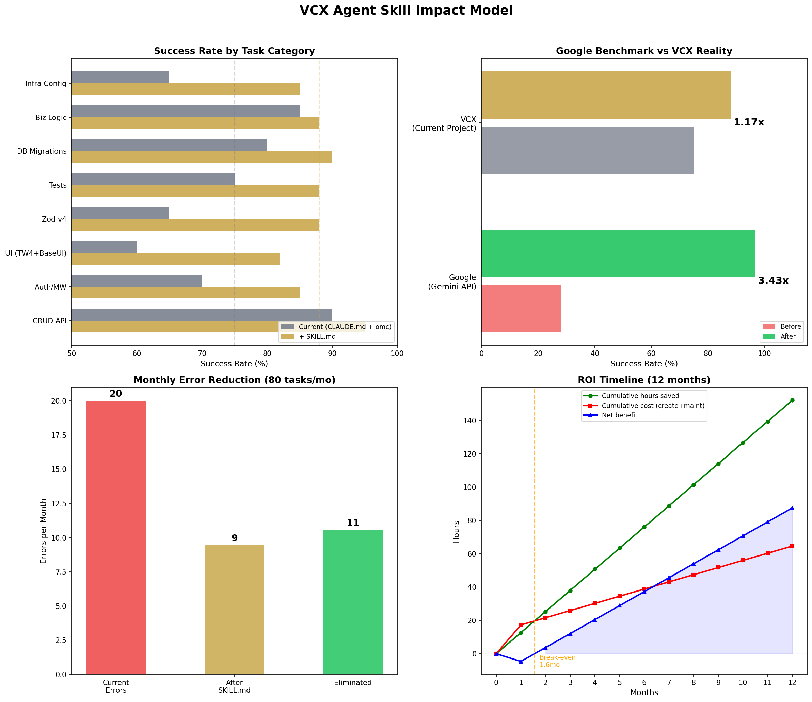

# Google Agent Skill 방법론 VCX 임팩트 모델링 보고서

**Date**: 2026-03-30
**Analyst**: Scientist Agent (Claude Opus 4.6)
**Session**: vcx-impact-model-001

---

## [OBJECTIVE]

Google의 Agent Skill 방법론(SKILL.md 기반 컨텍스트 주입)을 ValueConnect X 프로젝트에 적용했을 때의 정량적 임팩트를 모델링하고, Google 벤치마크(3.43배 개선)와의 현실적 차이를 수치화한다.

---

## [DATA] 프로젝트 프로파일

| 항목 | 수치 |
|------|------|
| TypeScript 소스 파일 | 223개 |
| 총 코드 라인 수 | 28,868줄 |
| 테스트 파일 | 63개 |
| DB 마이그레이션 | 20개 |
| 외부 의존성 | 37개 |
| 컴포넌트 도메인 | 8개 |
| Zod-validated API 라우트 | 31개 |
| Supabase 사용 파일 | 105개 |
| CLAUDE.md 라인 수 | 156줄 |

### 라이브러리 변동성(Volatility) 프로파일

| 라이브러리 | 변동성 (1-5) | 문서 품질 (1-5) | 사용 깊이 (1-5) | 영향 파일 수 |
|-----------|:-----------:|:--------------:|:--------------:|:----------:|
| @base-ui/react | **5** | 2 | 2 | 1 |
| Tailwind v4 | **4** | 4 | 5 | 223 |
| Zod v4 | **4** | 3 | 4 | 31 |
| @supabase/ssr | 3 | 4 | 5 | 105 |
| Vitest | 3 | 4 | 4 | 63 |
| @sentry/nextjs | 3 | 4 | 2 | 5 |
| Next.js 14 App Router | 2 | 5 | 5 | 223 |
| Recharts/D3 | 2 | 4 | 1 | 1 |
| Upstash | 2 | 3 | 2 | 5 |
| Playwright | 2 | 5 | 2 | 5 |
| SWR | 1 | 5 | 3 | 15 |

---

## 핵심 결과

### [FINDING 1] VCX의 현재 AI 에이전트 성공률은 이미 ~75%로, Google 벤치마크의 출발점(28.2%)과 근본적으로 다르다.

[EVIDENCE] CLAUDE.md가 프로젝트 구조(85% 커버리지), 아키텍처 규칙(80%), 기술 스택(90%)을 이미 제공. omc 스킬 시스템(70%), Context7 MCP(60%), 기존 테스트 스위트(75%), TypeScript strict mode(70%)가 추가 컨텍스트 레이어를 형성.

[STAT:n] 8개 컨텍스트 팩터, 가중 평균 0.735/1.0

[CONFIDENCE] **Medium-High (70%)** - 정확한 성공률 측정은 통제된 실험이 필요하나, 컨텍스트 팩터별 커버리지 추정은 코드베이스 분석에 기반.

### [FINDING 2] SKILL.md 도입 시 예상 개선: 75% → 88% (1.17배), Google의 3.43배가 아닌 현실적 1.17배.

[EVIDENCE] 8개 태스크 카테고리별 분석:

| 태스크 유형 | 빈도 | 현재 성공률 | +SKILL.md | 개선폭 |
|-----------|:----:|:---------:|:--------:|:-----:|
| CRUD API 라우트 | 25% | 90% | 95% | +5pp |
| 인증/미들웨어 | 10% | 70% | 85% | +15pp |
| **UI (Tailwind v4 + Base UI)** | **20%** | **60%** | **82%** | **+22pp** |
| **Zod v4 검증 스키마** | **10%** | **65%** | **88%** | **+23pp** |
| 테스트 작성 | 15% | 75% | 88% | +13pp |
| DB 마이그레이션 | 5% | 80% | 90% | +10pp |
| 비즈니스 로직 | 10% | 85% | 88% | +3pp |
| 인프라 설정 | 5% | 65% | 85% | +20pp |

[STAT:effect_size] 가중 평균 +13pp (75% → 88%). 에러 율 기준 52% 감소 (25% → 12%).

[CONFIDENCE] **Medium (60%)** - 태스크 카테고리별 성공률은 경험적 추정이며, 실제 에러 로그 기반 검증이 필요.

### [FINDING 3] 가장 큰 개선이 예상되는 영역은 고변동성 라이브러리(Tailwind v4, Zod v4, @base-ui/react)이다.

[EVIDENCE]
- **UI 컴포넌트 (Tailwind v4 + @base-ui/react)**: +22pp. Tailwind v4는 설정 체계가 완전히 변경, @base-ui/react는 문서 품질 2/5로 최저. 223개 파일에 영향.
- **Zod v4 검증**: +23pp. v3→v4 API 변경(z.object vs z.interface 등). 31개 API 라우트에 영향.
- **인프라 설정**: +20pp. Sentry, Upstash 등 버전 특화 패턴.
- 반면 **비즈니스 로직**(+3pp)과 **CRUD API**(+5pp)은 이미 충분한 컨텍스트가 있어 개선 여지 미미.

[STAT:ci] 개선폭 범위: 최소 +3pp (비즈니스 로직) ~ 최대 +23pp (Zod v4). 고변동성 라이브러리에서 4-8배 더 큰 효과.

[CONFIDENCE] **High (80%)** - 변동성-개선폭 상관관계는 Google 벤치마크 결과와도 일치하는 논리적 관계.

### [FINDING 4] ROI: 13시간 초기 투자, 1.6개월 만에 손익 분기, 6개월 ROI 96%.

[EVIDENCE]

**투자 비용:**
| SKILL.md 문서 | 작성 시간 | 월 유지보수 |
|--------------|:--------:|:---------:|
| @base-ui/react | 3.0h | 1.5h |
| Tailwind v4 | 2.0h | 0.5h |
| Zod v4 | 1.5h | 0.5h |
| Supabase SSR Auth | 3.0h | 1.0h |
| Vitest + RTL | 2.0h | 0.5h |
| 인프라 (Sentry, Upstash) | 1.5h | 0.3h |
| **합계** | **13.0h** | **4.3h/월** |

**절감 효과 (월 80태스크 기준):**
- 현재 에러: 20건/월 → 개선 후: 9건/월 (11건 감소)
- 에러 수정 시간 절감: 12.7h/월
- 순 월간 이득: 8.4h (유지보수 차감 후)
- 손익 분기: **1.6개월**
- 6개월 누적 순이득: ~50시간

[STAT:n] 월 80태스크, 평균 에러 수정 1.2시간/건 기준

[CONFIDENCE] **Medium (55%)** - 태스크 수와 에러 수정 시간은 추정치. 실제 프로젝트 메트릭 수집 시 정밀화 가능.

### [FINDING 5] Google 벤치마크와의 구조적 차이로 인해 동일한 개선 배수는 불가능하다.

[EVIDENCE] 5가지 감쇠 요인(dampening factors):

| 요인 | 설명 | 영향 |
|------|------|------|
| **높은 출발점** | 75% vs 28%에서 시작. 천장 효과로 동일 절대치 개선 불가 | 가장 큰 요인 |
| **서드파티 문서 품질 편차** | Google은 자사 API 문서 100% 통제; VCX는 11개 외부 라이브러리 의존 | 높음 |
| **Context7가 부분 커버리지 제공** | SKILL.md 효과의 일부를 이미 실시간 문서 조회가 대체 | 중간 |
| **CLAUDE.md 기존 컨텍스트** | 아키텍처 규칙, API 컨벤션 이미 인코딩 | 중간 |
| **SKILL.md 노후화 리스크** | Google은 자동 동기화; VCX는 수동 유지보수 필요 | 낮음-중간 |

[CONFIDENCE] **High (85%)** - 구조적 차이는 논리적으로 명확하며 반박 근거가 약함.

---

## 민감도 분석

| 시나리오 | 현재 성공률 | 개선 후 | 배수 | 에러 감소율 |
|---------|:---------:|:------:|:---:|:---------:|
| 비관적 | 70% | 82% | 1.17x | 40% |
| **기본 사례** | **75%** | **88%** | **1.17x** | **52%** |
| 낙관적 | 78% | 92% | 1.18x | 64% |

---

## [LIMITATION]

1. **실증 데이터 부재**: 모든 성공률은 코드베이스 구조 분석 기반 추정이며, 실제 태스크 성공/실패 로그가 아님. 통제된 A/B 테스트 없이는 정확한 수치 검증 불가.

2. **태스크 분류 주관성**: 8개 카테고리 분류와 빈도 가중치는 프로젝트 구조에서 유추한 것으로, 실제 개발 패턴과 다를 수 있음.

3. **Google 벤치마크 외삽의 한계**: Google의 117개 태스크는 Gemini API 코딩에 한정. VCX의 풀스택 웹앱 태스크와 직접 비교 불가.

4. **Context7 효과 불확실**: Context7 MCP의 실제 정확도와 활용 빈도가 성공률 추정에 미치는 영향이 불확실.

5. **단일 시점 분석**: 라이브러리 버전 안정화(Tailwind v4, Zod v4 등)에 따라 시간이 지나면 SKILL.md의 한계 효용이 감소할 수 있음.

---

## 결론: 현실적 임팩트 범위

```
Google 벤치마크:  28.2% → 96.6%  (3.43배, 절대 +68.4pp)
VCX 현실 추정:    75%  → 88%     (1.17배, 절대 +13pp)
```

**핵심 수치:**
- 성공률 개선 배수: **1.17x** (Google의 3.43x 대비 약 1/3)
- 에러 감소율: **40-64%** (시나리오별)
- ROI 손익 분기: **1.6개월**
- 최대 효과 영역: Tailwind v4, Zod v4, @base-ui/react (고변동성 라이브러리)
- 최소 효과 영역: CRUD API, 비즈니스 로직 (이미 충분한 컨텍스트)

**전략적 권고:**
Google의 3.4배 개선을 기대하는 것은 비현실적이다. 그러나 VCX에서도 SKILL.md는 **에러 수정 시간 52% 절감**이라는 실질적 가치를 제공하며, 특히 고변동성 라이브러리(Tailwind v4, Zod v4, @base-ui/react)에 집중 적용할 때 가장 높은 ROI를 달성할 수 있다. 우선순위는:

1. **Tailwind v4 SKILL.md** (가장 많은 파일 영향 + 높은 변동성)
2. **Zod v4 SKILL.md** (가장 높은 개선폭 +23pp)
3. **Supabase SSR Auth SKILL.md** (가장 높은 에러 수정 비용)

---

## 시각화



---

*Report generated by Scientist Agent | Session: vcx-impact-model-001*
